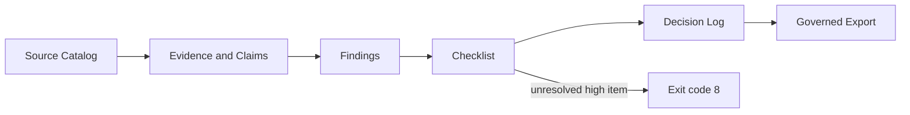

# Research Writing Workbench

[正體中文](README.zh-TW.md)

Research Writing Workbench is a governed Agent Skill toolkit for software-engineering, system-integration, asynchronous, event-driven, and engineering-artifact-based thesis research. It keeps source facts, extracted evidence, analysis findings, human decisions, and formal writing separate, then builds self-contained and reproducible Skill packages.

It is not a paper generator or a general guarantee of research validity. Code does not prove behavior, a passing test does not prove general reliability, a diff does not prove causation, and a local build is not a public release.

## Quick start

```powershell
py -m venv .venv
.\.venv\Scripts\python.exe -m pip install -r requirements-dev.txt
.\.venv\Scripts\python.exe build.py --check
.\.venv\Scripts\python.exe build.py
```

Install one generated directory from `dist/agents-skills/<skill>/` into a supported local Skill location, or use the integrated `dist/pack-<version>.zip`. See [installation](docs/INSTALL.md) and [Traditional Chinese usage](docs/USAGE.zh-TW.md).

## Skills

| Skill | Use it for |
|---|---|
| `$research-writing-workbench` | Route an engineering-research task through the CTCC control loop. |
| `$research-planning` | Define bounded questions, contracts, scenarios, milestones, and stop conditions. |
| `$literature-discovery` | Design reproducible searches and build a verified source catalog. |
| `$evidence-extract` | Extract source-linked facts, observations, and reproducible derivations. |
| `$research-synthesis` | Build Claim–Evidence matrices, preserve conflicts, and draft bounded claims. |
| `$methodology-review` | Audit validity, reproducibility, comparison fairness, and evidence sufficiency. |
| `$research-writing` | Draft or revise thesis prose from reviewed claims and evidence. |
| `$research-export` | Enforce formal-output gates and create an audit sidecar. |
| `$research-risk-watch` | Track corrections, retractions, source drift, gaps, privacy, and licensing risks. |

Example:

```text
Use $research-planning to turn this asynchronous-system problem into a bounded research question, validation contract, counterexample matrix, evidence plan, and milestones. Keep every unexecuted scenario as planned.
```

More copy-ready commands are in [prompts/commands.zh-TW.md](prompts/commands.zh-TW.md).

## Architecture and governance



The legacy Contract–Trace–Counterexample–Claim (CTCC) maturity, claim-type, researcher-decision, and unresolved-marker contracts remain intact. New JSON contracts add stable source IDs, hashes, locators, corpus snapshots, deterministic findings, idempotent review items, append-only decisions, and export audit reports. See [data contracts](docs/DATA-CONTRACTS.md) and [architecture](docs/architecture.md).

## Validation

Run all project commands through the repository `.venv`:

```powershell
.\.venv\Scripts\python.exe -m compileall -q build.py scripts tests
.\.venv\Scripts\python.exe -m pytest -q
.\.venv\Scripts\python.exe build.py --check
.\.venv\Scripts\python.exe build.py
git ls-files dist
git diff --check
```

Passing repository checks proves only the checked contracts. It does not establish research validity, public release status, platform installation success, or general effectiveness.

## Limitations, contribution, and license

The deterministic CLI uses Python's standard library at runtime. Development tests use the pinned ranges in `requirements-dev.txt`. External search, source verification, ethics review, statistical review, copyright clearance, and final claims remain human responsibilities.

Read [CONTRIBUTING.md](CONTRIBUTING.md), [SECURITY.md](SECURITY.md), and the [content policy](docs/governance/content-policy.md). Repository-authored content is licensed under [MIT](LICENSE); that license does not extend to referenced books, purchaser-only attachments, papers, datasets, images, or other third-party material. See [THIRD_PARTY_NOTICES.md](THIRD_PARTY_NOTICES.md).
