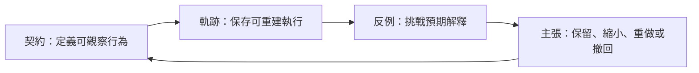

# Research Writing Workbench

[English](README.en.md)

Research Writing Workbench 是適用於軟體工程、系統整合與事件驅動系統研究的開源 repository skill。它協助研究者把程式、測試、Trace、Log、Diff 與執行紀錄組成可重現、可反駁且範圍有限的研究證據。

**它不是通用研究方法，也不是論文產生器。** 程式存在不等於行為正確，測試通過不等於系統可靠，Diff 不等於因果，可建置不等於有效。研究問題、驗證契約、結果解釋與最後主張仍由研究者負責。

## 核心方法

本專案使用「契約—軌跡—反例—主張」（Contract–Trace–Counterexample–Claim, CTCC）控制環：



- 契約：統一輸入、完成、錯誤、逾時、重試、順序、併發、觀測與比較條件。
- 軌跡：索引版本、設定、命令、exit code、測試、事件、Trace、Log 與 Diff。
- 反例：事前設計逾時、斷線、重複、亂序、並行覆寫與觀測缺口等案例。
- 主張：只在實際執行與反例允許的範圍內陳述，證據不足時縮小或撤回。

完整方法在 [正式 Skill](.agents/skills/research-writing-workbench/SKILL.md)；架構說明見 [docs/architecture.md](docs/architecture.md)。

## 適用範圍

- 軟體工程與軟體架構研究。
- 外部 API、系統整合、事件驅動及非同步系統。
- 開源工具、Workbench 與小型框架。
- 程式測試、故障重現與 Trace Replay。
- AI 生成程式或判斷的證據檢查。
- 以工程產物為主要材料的設計型或案例型研究。

## 快速開始

在 Codex 開啟 repository 後：

```text
使用 $research-writing-workbench，根據我提供的程式、測試與執行紀錄建立驗證契約和反例矩陣。尚未實際執行的內容保持 planned，最後只提出證據能支持的有限主張。
```

其他聊天模型可使用 [通用 Prompt](prompts/master-prompt.zh-TW.md)，但這不代表官方相容。詳細操作見 [開始使用](docs/getting-started.zh-TW.md)。

## 專案緣起與來源邊界

本專案以《AI 研究寫作全攻略》帶來的研究角色反思為起點，再依專案作者自述的軟體工程專案、專題實作與論文研究歷程，獨立設計 CTCC、資料格式、研究產物與操作慣例。它不重製、改寫、散布或相容實作該書讀者／購書者專屬附件。

完整說明、書目與授權邊界見 [專案緣起與方法來源](docs/method-origin.md)。

## Repository map

- `.agents/skills/research-writing-workbench/`：唯一正式 Skill 來源。
- `prompts/`：簡化的通用聊天介面。
- `examples/`：合成且未執行的工程研究規畫。
- `docs/`：架構、方法來源、維護與治理。
- `scripts/`、`tests/`：驗證、隱私掃描與可重現封裝。

## 驗證

```shell
python scripts/check_all.py
python scripts/package_skill.py --output-dir .work/package-smoke
```

驗證通過只代表 repository 契約與掃描規則通過，不證明方法有效或適用於所有研究。

## 貢獻與授權

請閱讀 [CONTRIBUTING.md](CONTRIBUTING.md)、[內容政策](docs/governance/content-policy.md) 與 [SECURITY.md](SECURITY.md)。本 repository 自行建立的內容採 [MIT License](LICENSE)；授權不延伸至參考書籍、購書附件或其他第三方內容，詳見 [THIRD_PARTY_NOTICES.md](THIRD_PARTY_NOTICES.md)。
