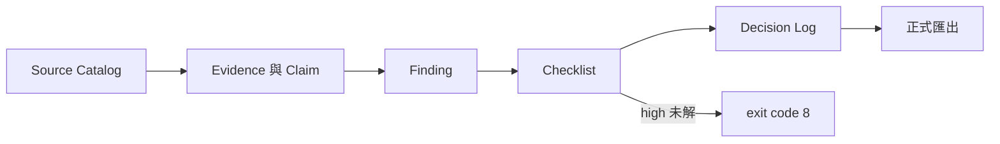

# Research Writing Workbench

[English](README.md)

Research Writing Workbench 是適用於軟體工程、系統整合、非同步與事件驅動系統論文研究的受治理 Agent Skill 工具包。它把來源事實、證據抽取、分析 Finding、人工裁定與正式寫作分層，並產生自足、可重現的 Skill 發行候選。

它不是論文產生器，也不保證研究有效。程式存在不等於行為正確，測試通過不等於一般可靠，Diff 不等於因果，本機建置也不等於公開發布。

## 快速開始

```powershell
py -m venv .venv
.\.venv\Scripts\python.exe -m pip install -r requirements-dev.txt
.\.venv\Scripts\python.exe build.py --check
.\.venv\Scripts\python.exe build.py
```

從 `dist/agents-skills/<skill>/` 安裝單一 Skill，或使用 `dist/pack-<version>.zip` 整合包。詳見[安裝](docs/INSTALL.md)與[使用指南](docs/USAGE.zh-TW.md)。

## Skill 與指令

| Skill | 適用工作 |
|---|---|
| `$research-writing-workbench` | 依 CTCC 路由跨階段工程研究工作。 |
| `$research-planning` | 規劃有界研究問題、契約、情境、里程碑與停止條件。 |
| `$literature-discovery` | 設計可重跑檢索並建立已驗證來源目錄。 |
| `$evidence-extract` | 從論文、程式、測試、Trace、Log 或資料抽取可定位證據。 |
| `$research-synthesis` | 建立 Claim–Evidence 矩陣、保存衝突並裁定有限主張。 |
| `$methodology-review` | 審查效度、可重現性、比較公平性與證據充分度。 |
| `$research-writing` | 依 reviewed Claim 與 Evidence 起草或改寫論文章節。 |
| `$research-export` | 執行正式輸出閘門並產生 audit sidecar。 |
| `$research-risk-watch` | 追蹤勘誤、撤稿、來源漂移、缺口、隱私與授權風險。 |

```text
使用 $research-writing，依 CL-003、EV-008 與已驗證來源起草限制段。保留版本、locator、反例與不得外推範圍；缺少材料時標記 [未取得產物]。
```

更多可直接貼上的指令見 [prompts/commands.zh-TW.md](prompts/commands.zh-TW.md)。

## 架構與治理



既有「契約—軌跡—反例—主張」（CTCC）成熟度、主張種類、研究者裁定與未解標記全部保留。新增資料契約涵蓋穩定 source ID、SHA-256、locator、Corpus Snapshot、確定性 Finding、冪等 Checklist、追加式 Decision Log 與匯出 sidecar。詳見[資料契約](docs/DATA-CONTRACTS.md)與[架構](docs/architecture.md)。

## 驗證

所有專案 Python 命令只透過 `.venv`：

```powershell
.\.venv\Scripts\python.exe -m compileall -q build.py scripts tests
.\.venv\Scripts\python.exe -m pytest -q
.\.venv\Scripts\python.exe build.py --check
.\.venv\Scripts\python.exe build.py
git ls-files dist
git diff --check
```

驗證通過只代表列出的 repository 契約通過，不證明研究有效、平台已安裝、內容可公開或方法普遍有效。

## 限制、貢獻與授權

執行階段 CLI 只依賴 Python 標準函式庫；開發測試相依記錄在 `requirements-dev.txt`。外部文獻檢索、來源查證、研究倫理、統計審查、著作權確認與最終主張仍由研究者負責。

請閱讀 [CONTRIBUTING.md](CONTRIBUTING.md)、[SECURITY.md](SECURITY.md)與[內容政策](docs/governance/content-policy.md)。本 repository 自行建立的內容採 [Apache License 2.0](LICENSE)；授權不延伸至參考書籍、購書附件、論文、資料集、圖片或其他第三方內容。
