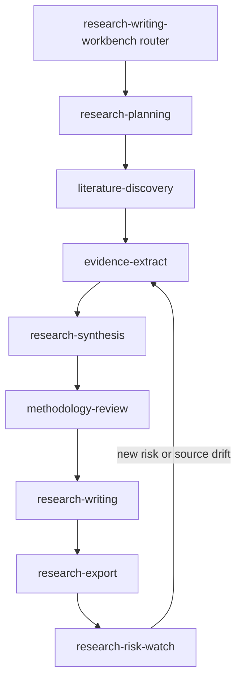
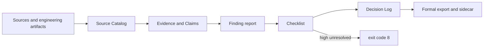

# Architecture

## Authoring and distribution boundaries

`skills/` is the only Skill source tree. `shared/` is the only source for governance Schemas and cross-Skill rules. Root `scripts/` contains deterministic CLIs. `build.py` uses explicit maps to assemble each self-contained Skill under `dist/agents-skills/` and deterministic archives under `dist/claude/`.

The source tree is not recursively copied. Tests, CI, fixtures, examples, `.work`, private sources, reports, exports, caches, and authoring history are excluded unless an explicit distribution map names a file.

## Workflow architecture

These are capability boundaries, not mandatory paper chapters. Invoke only the Skills needed for the request, but keep stable IDs across handoffs.

## Governance data flow

Findings never directly modify core Sources, Evidence, or Claims. Only the resolution CLI applies explicit decisions to listed Checklist fingerprints and appends the Decision Log. Formal export accepts only active, reviewed or confirmed, source-grounded claims.

## CTCC compatibility

The legacy Contract–Trace–Counterexample–Claim loop remains the engineering-research control loop. Its maturity, claim-type, researcher-decision, unresolved-marker, template-field, and evidence-boundary contracts remain unchanged. The JSON governance layer is additive and does not promote Markdown artifact maturity.

## Build safety and reproducibility

Builds occur in temporary staging. A full build replaces only the resolved repository-root directory named exactly `dist`. ZIP entries use sorted paths, `/` separators, a fixed timestamp, fixed permissions, DEFLATE level 9, and a stable top-level layout. `checksums.sha256` covers all generated files except itself.
