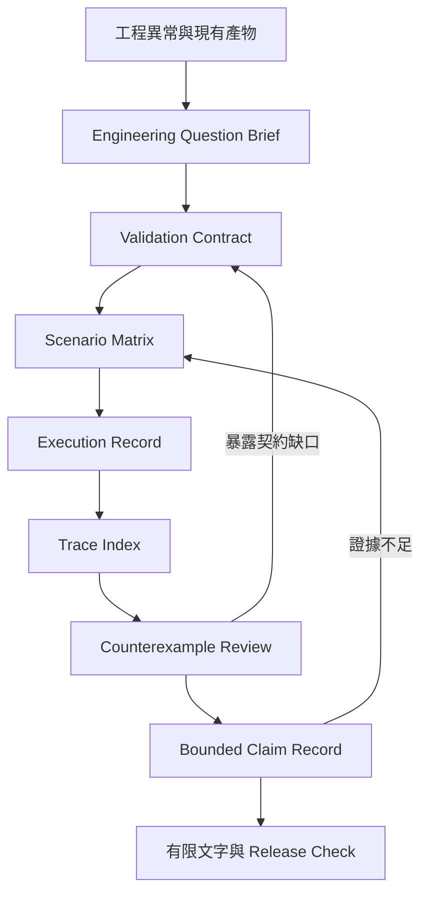

# Architecture

## 單一正式來源

`.agents/skills/research-writing-workbench/` 是唯一可發布的 Skill。`SKILL.md` 負責觸發、適用範圍、CTCC Workflow 與核心邊界；`references/` 保存領域規則；`assets/templates/` 定義正式研究產物。

根目錄 Prompt 是較短的聊天介面，不複製完整 reference。README、docs 與 examples 用於安裝、治理與展示，不能成為第二份方法正文。

## CTCC 資料流



這是可回饋控制環，不是論文章節順序。只有實際執行與可定位產物能把成熟度由 `planned` 提升；研究者才能裁定主張為 `keep`、`narrow`、`rework` 或 `withdraw`。

## 相依方向

```text
SKILL.md ──> references/
    │       assets/templates/
    └─────> 任務執行規則

README/docs ──> 使用、架構與治理
prompts     ──> 簡化聊天介面
scripts/tests ──> 結構、來源隔離、隱私與封裝驗證
```

正式封裝只包含 Skill 目錄。來源附件、`.work`、tests、examples、dist cache 與 repository 治理文件不能進入發布 ZIP。

## 變更規則

變更成熟度、主張種類、模板欄位或 Workflow 時，同步更新相關 reference、Prompt、README、範例、測試與 CHANGELOG。驗證器拒絕前身附件的舊檔名與高辨識度架構標記，以降低內容回流風險。
